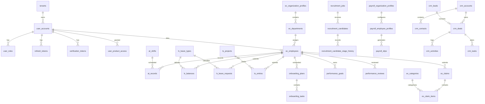

# Database Design And ERD

## Database Strategy

Nexra uses Flyway-managed relational schema evolution. Production uses MySQL. Tests use H2. Each module owns its tables and stores `tenant_code` or tenant linkage for isolation.

Common persistence requirements:

- primary keys are UUID or module-specific identifiers
- mutable business entities use optimistic locking with `version`
- business records include audit timestamps and actor fields where applicable
- tenant-scoped list and lookup queries require indexes
- high-value records should avoid hard delete unless explicitly approved

## Main Tables By Module

| Module | Tables |
| --- | --- |
| Auth | `tenants`, `user_accounts`, `user_roles`, `verification_tokens`, `refresh_tokens`, `oauth2_registered_client`, `oauth2_authorization`, `oauth2_authorization_consent`, `user_product_access` |
| Employee Core | `ec_organization_profiles`, `ec_departments`, `ec_employees` |
| Attendance | `at_shifts`, `at_records` |
| Leave | `lv_leave_types`, `lv_holidays`, `lv_balances`, `lv_leave_requests` |
| Timesheet | `ts_projects`, `ts_entries` |
| Onboarding | `onboarding_plans`, `onboarding_tasks` |
| Performance | `performance_goals`, `performance_reviews` |
| Recruitment | `recruitment_jobs`, `recruitment_candidates`, `recruitment_candidate_stage_history` |
| Expense | `ex_categories`, `ex_claims`, `ex_claim_items` |
| Payroll | `payroll_organization_profiles`, `payroll_employee_profiles`, `payroll_slips` |
| CRM | `crm_leads`, `crm_accounts`, `crm_contacts`, `crm_deals`, `crm_activities`, `crm_tasks` |
| Audit | `audit_events` |

## MVP-Critical Table Detail

| Table | Key Columns | Important Constraints And Indexes | Migration |
| --- | --- | --- | --- |
| `tenants` | `id`, `code`, `name`, `status`, audit columns, `version` | unique `code`, index on `code` | `V1`, `V37` |
| `user_accounts` | `id`, `tenant_id`, `email`, `password_hash`, `status`, audit columns, `version` | unique `(tenant_id, email)`, index `(tenant_id, email)` | `V1`, `V37` |
| `refresh_tokens` | `id`, `user_id`, `token_hash`, `expires_at`, `revoked_at`, `version` | unique `token_hash`, index `token_hash` | `V1`, `V4`, `V37` |
| `user_product_access` | `id`, `user_id`, `product`, `role`, audit columns, `version` | unique `(user_id, product)`, index `user_id` | `V3`, `V37` |
| `ec_organization_profiles` | `id`, `tenant_code`, organization details, audit columns, `version` | unique `tenant_code` | `V10`, `V37` |
| `ec_departments` | `id`, `tenant_code`, `code`, `name`, audit columns, `version` | unique `(tenant_code, code)`, index `tenant_code` | `V10`, `V37` |
| `ec_employees` | `id`, `tenant_code`, `employee_code`, `work_email`, `department_id`, `user_account_id`, audit columns, `version` | unique `(tenant_code, employee_code)`, unique `(tenant_code, work_email)`, indexes on tenant, department, user account | `V10`, `V37`, `V42` |
| `at_records` | `id`, `tenant_code`, `employee_id`, `work_date`, `check_in`, `check_out`, `status`, `version` | unique `(tenant_code, employee_id, work_date)`, indexes on tenant/date and tenant/employee | `V30`, `V37` |
| `lv_leave_requests` | `id`, `tenant_code`, `employee_id`, `leave_type_code`, dates, `status`, `version` | indexes on `(tenant_code, employee_id)` and `(tenant_code, status)` | `V31`, `V37` |
| `ts_entries` | `id`, `tenant_code`, `employee_id`, `project_id`, `work_date`, hours, `status`, `version` | indexes on `(tenant_code, employee_id, work_date)` and `(tenant_code, status)` | `V32`, `V37` |
| `ex_claims` | `id`, `tenant_code`, `employee_id`, totals, `status`, submitted/decision fields, `version` | indexes on `(tenant_code, status)` and `(tenant_code, employee_id)` | `V36`, `V37`, `V38` |
| `payroll_employee_profiles` | `id`, `tenant_code`, `employee_id`, salary fields, audit columns, `version` | unique `(tenant_code, employee_id)`, index `tenant_code` | `V21`, `V37` |
| `payroll_slips` | `id`, `tenant_code`, `employee_id`, payroll period, gross/deductions/net, document fields, audit columns, `version` | index `(tenant_code, generated_at)` | `V21`, `V40` |
| `crm_leads` | `lead_id`, `tenant_code`, lead details, owner, status, audit columns | unique `(tenant_code, email)`, index `(tenant_code, owner_user_id, status)` | `V39` |
| `audit_events` | `event_id`, `tenant_code`, `actor`, `action`, `resource`, `occurred_at`, payload metadata | unique `event_id` | `V41` |

## Migration Order

1. Auth and OAuth base schema: `V1` to `V4`.
2. Employee core schema: `V10`.
3. Payroll reference and persistence schema: `V20` to `V21`.
4. HRMS workflow schemas: `V30` to `V36`.
5. Cross-module hardening: optimistic locking, constraints, indexes: `V37` to `V38`.
6. CRM persistent schema: `V39`.
7. Payroll audit alignment: `V40`.
8. Audit event schema: `V41`.
9. Employee/user linkage: `V42`.

Migration rule: new schema changes must be appended as new Flyway files. Existing applied migrations must not be rewritten after release.

## High Level ERD

## Key Constraints

- `tenants.code` is unique.
- `user_accounts` email is unique per tenant.
- `user_product_access` is unique per user and product.
- employee code and work email are unique per tenant.
- shifts, leave types, departments, expense categories, projects, and CRM lead email use tenant-scoped uniqueness where applicable.
- attendance has one record per tenant, employee, and work date.
- performance review is unique per tenant, employee, and cycle.

## Data Retention Guidance

- Auth tokens: retain only until expiration plus operational grace period.
- Audit events: retain according to customer contract and compliance target.
- Payroll slips: retain according to statutory geography.
- Employee PII: support future retention and deletion policy by tenant.
- CRM leads and business records: soft delete or status-based archival is preferred.

## Future Data Work

- Add a reporting read-model schema.
- Add workflow approval tables.
- Add document metadata and object storage references.
- Add notification delivery logs.
- Add import/export job tables.
- Add data retention and anonymization jobs.
